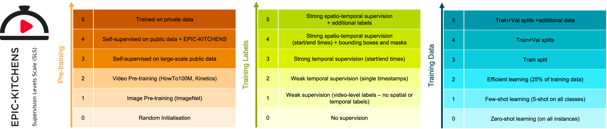

# Supervision Levels Scale (SLS)

> [EPIC-KITCHENS-100](https://epic-kitchens.github.io/) is the largest dataset in first-person (egocentric) vision. In this file, we propose the scale below to encode the supervision levels of the methods submitted to the various challenge leaderboards of EPIC-KITCHENS.   

### Introduction
As methods submit to the challenge leaderboards, they are requested to declare the level of supervision used in training their model(s). The introduction of the Supervision Levels Scale (SLS) intends to acknowledge methods that use less supervision as well as identify how additional supervision assists performance. In [this technical report](SLS.pdf), we propose a general SLS framework, which is adapted to the EPIC-KITCHENS dataset challenges, as detailed next.

**We do not encourage or discourage any level of supervision**. We will decide the winners for the various awards by the rank on the leaderboard regardless of the level of supervision. However, we reserve the right to award additional awards when sufficient methods have successfully competed with significantly less supervision. 

While we rely on self reporting of SLS, per submission, we reserve the right to request the training code or model details to check the correctness of the indicated supervision level.

* SLS is proposed by: Dima Damen and Michael Wray

* Contact: [uob-epic-kitchens@bristol.ac.uk](mailto:uob-epic-kitchens@bristol.ac.uk)

### Citing
When using the scale, kindly reference:
```
@techreport{Damen2020SLS,
   title={Supervision Levels Scale (SLS)},
   author={Damen, Dima and Wray, Michael},
           institution   = {University of Bristol},
           year      = {2020},
           month     = {8},
           Date-Added = {2020-08-20}
} 
```

### Summary


### SLS Dimensions

Our proposed SLS is split into three dimensions: Pre-training (PT), Training labels (TL) and amount of Training data (TD)

#### 1- SLS Pre-Training (SLS-PT) 

| PT   | Supervision Level                                           | Description                                                  |
| ---- | ----------------------------------------------------------- | ------------------------------------------------------------ |
| 0    | No pretraining                                              | Model weights were all trained from random initialisations   |
| 1    | Pre-trained on Public image datasets                        | Pre-trained on image datasets, e.g. ImageNet, MSCOCO         |
| 2    | Pre-trained on Public image and video datasets              | Pre-trained on labelled video datasets, e.g. Kinetics, Something-Something. These could also be pre-trained from ImageNet weights |
| 3    | Self-supervised pre-training on public data                 | Pre-trained on a large amount of videos, without the use of labels. All data used in pretraining is publicly available |
| 4    | Self-supervision on public data + videos from EPIC-KITCHENS | Pre-trained in a self-supervised manner on videos from EPIC-KITCHENS (no labels used). Additional public data can also be used in pre-training. |
| 5    | Private data is used in pre-training                        | Pre-training has made use of private data that is not publicly accessible [allowed though discouraged - typically employed by industrial research labs] |

#### 2- SLS Training Labels (SLS-TL) 

Available labels in our dataset are:

``narration-timestamp / start / end / caption / verb-class / noun-class / verb-category / noun-category ``

Additionally, spatial labels are available from manually annotated bounding boxes as well as automatically extracted masks and hand/object spatial interaction annotations are provided. We refer to these collectively as 

```
spatial-annotations
```

Based on the above, we define the following levels of supervision, given the utilisation of labels.

**Important**: Please note specific challenge rules which prohibit the utilisation of certain labels. For example in *action detection*, start/end times in the test set cannot be utilised. Similarly, in *unsupervised domain adatptation for action recognition* class labels in the target domain cannot be utilised. 

| TL   | Supervision Level                          | Description                                                  |
| ---- | ------------------------------------------ | ------------------------------------------------------------ |
| 0    | No supervision                             | Pre-trained model was used as is without additional training on labels from EPIC-KITCHENS |
| 1    | Weak-supervision (class)                   | For each video, the order of ```captions/verb-class/noun-class``` labels is used, but no temporal or spatial information is given/used. |
| 2    | Weak-supervision (timestamp)               | narration-timestamp are known, without start/end time labels, i.e. ```narration-timestamp / caption / verb-class / noun-class``` |
| 3    | Full-temporal-supervision                  | ```narration-timestamp / start / end / caption / verb-class / noun-class``` are used in training, i.e. start/end times are utilised |
| 4    | Full-temporal-and-spatial supervision      | In addition to the above, ```spatial-annotations``` provided by with the dataset have been utilised, in addition to any additional spatial labels (e.g. pretrained segmentation models). [*all labels used in training the model should be made publicly available to participate in any challenge*] |
| 5    | Full-supervision with additional knowledge | Category labels (or additional prior knowledge labels) have been utilised, i.e. ``verb-category / noun-category ``, or prior knowledge of class relationships from other corpora. This signifies additional prior knowledge outside the labels specified. [*all labels used in training the model should be made publicly available to participate in any challenge*] |

#### 3- SLS Training Data (SLS-TD) 

| TD   | Supervision Level  | Description                                                  |
| ---- | ------------------ | ------------------------------------------------------------ |
| 0    | Zero-shot learning | 0% of the data was used in training the model. Only the class knowledge is incorporated |
| 1    | Few-shot learning  | Up to 5 examples were used to train each verb-class or noun-class in the data |
| 2    | Efficient Learning | A selected sample of no more than 25% of the training data was used to train the model. |
| 3    | Training set       | The training set was fully used to train the model           |
| 4    | Train+Val set      | Both the training and validation sets were used to train the model |
| 5    | Train+Val++ set    | All labelled data in Train+Val was used in addition to other labelled or un-labelled data from additional sources. Note that this is different from data used in pre-training. This is additional data used in training the final model itself. [*all data used in training the model should be made publicly available to participate in any challenge*] |

### Putting it together

The three dimensions are then put together for each method, in the order:

```
SLS-PT-TL-TD
```

For example, if you wish to submit a model to the leaderboard, that has been pre-trained on Kinetics, utilises all spatial and temporal labels provided by the dataset in addition to verb and noun categories, fine-tuned on train+val sets, the method would be listed as:

```
SLS-2-5-4
```

A method that has been trained from scratch, utilises single-timestamp temporal supervision without any object labels and has been trained with less than 25% of the training data would be listed as:

```
SLS-0-3-2
```

SLS would thus give an indication of the amount of supervision offered to the two methods, when comparing their performances.

